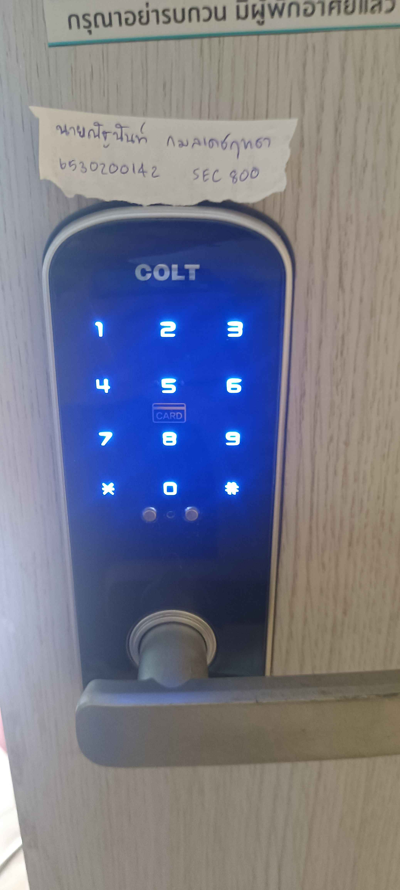

# Security-Control  
## Digital Door Lock
- **Location** : Condo
- **Control Function** : Preventative
- **Type of Security Control** : Physical Control

### เป็น Physical Control เพราะ
- Digital Door Lock เป็นอุปกรณ์ที่ใช้ควบคุมการเข้าถึงทางกายภาพของพื้นที่
- จำกัดการเข้า-ออกโดยใช้ PIN
- ป้องกันบุคคลที่ไม่ได้รับอนุญาตไม่ให้เข้าถึงสถานที่สำคัญ

### เป็น Preventative Control เพราะ
- ป้องกันการบุกรุกหรือการโจรกรรม ก่อนที่จะเกิดขึ้น
- ลดโอกาสที่ผู้ไม่ได้รับอนุญาตจะสามารถเข้าไปขโมยทรัพย์สิน
- มี ระบบล็อกอัตโนมัติ
